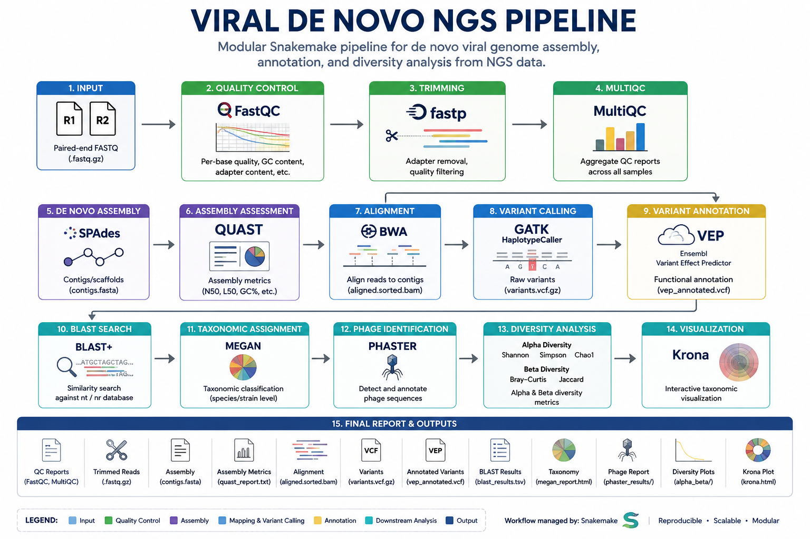

# Viral De Novo NGS Pipeline

A modular and reproducible Snakemake-based pipeline for de novo viral genome analysis from Next-Generation Sequencing (NGS) data.

---

## Overview

This pipeline automates the analysis of paired-end sequencing data using Snakemake. It performs quality control, trimming, de novo assembly, alignment, variant analysis, taxonomy classification, phage identification, diversity analysis, and report generation.

## Features

- Automated quality control using FastQC and MultiQC
- Adapter trimming with FastP
- De novo genome assembly using SPAdes
- Assembly quality assessment with QUAST
- Read alignment using BWA
- Variant calling using GATK
- Variant annotation using VEP
- BLAST sequence search
- Taxonomic classification
- PHASTER phage identification
- Alpha, Beta and Gamma diversity analysis
- Krona visualization
- Final report generation

## Pipeline Workflow

